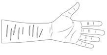
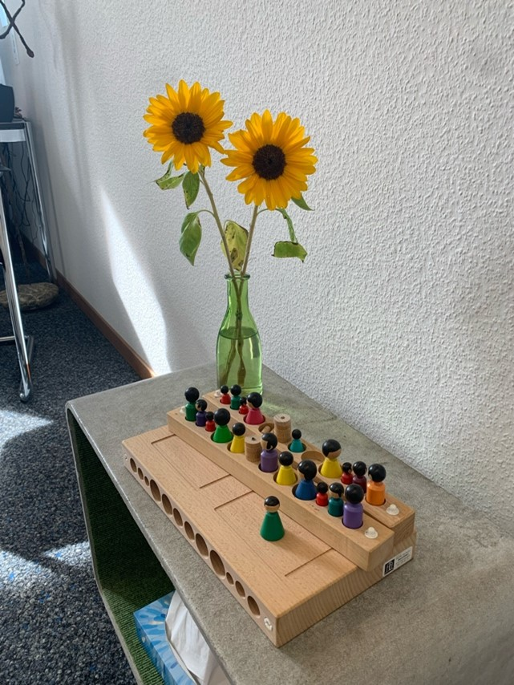

+++
title = "Selbstverletzung bei Jugendlichen (Reportage) "
date = "2024-06-11"
draft = true
pinned = false
image = "grafik-deutsch.png"
+++
Zwischen Schmerz und Hoffnung
Die Narben verraten es, aber keiner kann es verstehen. 

Narben. Das ist das Erste, was uns in diesem Moment in die Augen sticht. Wir beobachten das Mädchen, welches vor uns auf ihrem Handtuch sitzt und seelenruhig auf den Sprungturm in der Badi hinaufschaut. Verstohlen lassen wir unsere Augen über ihren Körper wandern. Narben am linken Arm, 

Narben an den Oberschenkeln. Uns wird sofort klar, um welche Art Verletzungen es sich dabei handelt. Fragen kommen in uns auf. Wie zerbrochen muss ein Mensch innerlich sein, damit er sich sowas antut? Was bringt einen Menschen dazu, sich selbst so sehr zu verletzen, wodurch lebenslange Narben den Körper zieren? Und wie sollen Personen wie wir in so einer Situation reagieren? Soll man überhaupt reagieren?
Auf der Suche nach Antworten auf unsere Fragen treffen wir Frau Thalmann, eine Systemtherapeutin  und Frau Kao, eine PhD Studentin. Sie haben sich bereit erklärt, in einem Interview unsere Fragen zu beantworten. Wir sind beide sehr nervös, aber zugleich auch neugierig als wir bei der Berner Gesundheit und UPD klingeln und unsere Fragen stellen dürfen. 

Auslöser für selbstverletzendes Verhalten

Frau Thalmann erklärt uns, es gebe sogenannte Entwicklungsaufgaben im Jugendalter. Diese können zu einer Herausforderung oder einem Problem werden. Diese Entwicklungsaufgaben seien z.B. das Ablösen von den Eltern, die Studien- oder Berufswahl, das Akzeptieren des eigenen Körpers, Freundschaften mit Gleichaltrigen und die Entwicklung der eigenen Werte. Wenn diese genannten Punkte verletzt werden würden, könne dies zu einer Überforderung führen. Diese Überforderung werde zu einer so grossen Belastung, dass manche Jugendlichen beginnen sich zu verletzen, sich zu treten, zu ritzen oder depressive Verstimmungen haben. Sich selbst Schmerzen zuzuführen, gebe den Jugendlichen ein entspanntes Gefühl. 
Hinter dem Selbstverletzen steckt ein Leiden. Das kann z.B ein Streit, ein Konflikt in der Familie, Hilflosigkeit oder Überforderung sein. 

Begleitete Essstörungen?

Frau Thalmann erklärt uns, selbstverletzendes Verhalten sei oft begleitet mit Essstörungen. Diese Kombination trete vor allem bei jungen Frauen auf. Hingegen Frau Kao erklärt, dass Selbstverletzendes Verhalten nicht so häufig von Essstörungen begleitet sei. Natürlich könne es vorkommen, häufig sei es aber nicht. Dies läge daran, dass Essstörungen kontrolliert ablaufen und mit vielen Gedanken verbunden seien. Hingegen bei selbstverletzendem Verhalten reagieren Betroffene impulsiv und machen sich im Voraus keine Gedanken über ihre Handlungen.
Frau Thalmann erwähnt, dass sich jede fünfte Jugendliche ritze sich einmal im Leben. Diese Zahl beunruhigt uns stark, wir achten öfters auf Narben und andere Anzeichen von Selbstverletzung. Frau Thalmann ist der Meinung, besorgniserregend sei es erst bei wiederholtem Auftreten, welches etwa 5-10% der Jugendlichen betreffe. 

«Hilfeholen ist keine Schwäche»

In den letzten Jahren haben Selbstverletzungen bei Jugendlichen zugenommen. Die Jugendlichen belaste das instabile Weltgeschehen und auch Corona habe sie geprägt. Der Druck, welcher meist von den Eltern ausgeübt werde, mache den Jugendlichen stark zu schaffen. Heute werde das Thema öfters angesprochen und dies führe zu mehr besetzten Therapieplätzen. «Hilfeholen ist keine Schwäche», diese Aussage von Frau Thalmann erachten wir als bedeutend und essenziell. 
Die Unterstützung der Familie und anderen vertrauten Personen sind im Leben der Jugendlichen unentbehrlich. Für die Betroffenen ist ein Gespräch mit einer aussenstehenden Person sehr wertvoll, daher nehmen viele Jugendliche eine Therapie in Anspruch. Die Gespräche verlaufen unter vier Augen, wenn die betroffene Person jedoch von Suizidgedanken spricht, wird sehr zielstrebig darauf hingearbeitet, dass jemand aus dem Umfeld mit einbezogen wird, um möglichst kein Risiko einzugehen. 
Ein vertrauenswürdiges Umfeld kann vieles vereinfachen und gibt den betroffenen Personen eine zusätzliche Möglichkeit über Selbstverletzung zu sprechen. Die Gespräche über Selbstverletzung sind oftmals mit viel Scham verbunden. Frau Thalmann erklärt uns, dass es sich um ein Suchtverhalten handle, die Folgen seien den Jugendlichen und den Betroffenen zum Zeitpunkt der Selbstverletzung nicht bewusst. 

Kann das eigene Blut beruhigend sein?

Jugendliche finden immer einen Weg sich selbst zu verletzen. “Es gibt nichts, was es nicht gibt”, antwortet Frau Thalmann auf die Frage, an welchen Stellen und mit welchen Mitteln sich die meisten Jugendlichen Schmerzen zufügen. Manche Jugendliche könnten das Blut nicht sehen, andere sagen, es beruhige sie. 
Wir sind sehr schockiert, als wir hören, dass das Sehen des eigenen Blutes beruhigend sein soll. Wir persönlich empfinden eher das Gegenteil. Uns wird häufig unwohl, wenn wir Blut sehen, vor allem, wenn es sich um unser eigenes handelt.
Wir beobachten in der Schule aber auch in der Freizeit überwiegend Mädchen, welche sich selbst verletzen. Wir nutzen unsere Chance bei der Berner Gesundheit und erkundigen uns bei Frau Thalmann, was Ihre Erfahrungen sind und inwiefern das Geschlecht einen Einfluss auf Selbstverletzung hat. Dieses Gespräch erweitert unseren Horizont. Junge Männer verarbeiten ihr Leiden, indem sie beispielsweise in eine Wand schlagen. Schläge, welche zu Verletzungen führen, wie zum Beispiel blutenden Händen, wird auch als eine Art der Selbstverletzung angesehen. Junge Frauen dagegen versuchen ihre Probleme mit sich allein im Stillen auszumachen, dies führt oft zu selbstverletzendem Verhalten. Zudem ist der Einfluss von Social Media nicht zu unterschätzen. Überall hört man: «Schau mal, was für ein hübsches und makelloses Gesicht sie hat. Ihre Figur ist perfekt, ihre Oberschenkel berühren sich nicht und ihr Bauch ist ideal für einen Bikini!» Solche Aussagen können viele Mädchen stark beeinflussen und dazu führen, dass sie ihre Ernährung ändern oder übermäßig viel Sport treiben. «Männer sollten ein Sixpack haben und generell muskulös sein.» Auch bei jungen Männern wird das Schönheitsideal immer ausgeprägter.

Gos- und No-Gos

Des Weiteren erzählt Frau Thalmann, dass manche Betroffene froh seien, wenn man reagiere und sie darauf anspreche. Es ist fast immer sehr schwierig, den richtigen Moment zu erwischen, um das selbstverletzende Verhalten anzusprechen. Oftmals ist es schwierig die passenden Worte zu finden, zudem fürchten sich viele vor der Reaktion des Gegenübers. Die meisten Betroffenen schämen sich extrem für ihre Verletzungen. Aufgrund dessen vermeiden sie Ausflüge ins Schwimmbad, aus Angst man könne ihre Narben und Verletzungen sehen. Deshalb tragen sie auch im Hochsommer langärmlige Kleidung. Somit merkt man als Freund, Freundin oder Eltern auch lange nichts von den selbst zugefügten Verletzungen. Betroffene sind Meister*innen im Kaschieren. Teenager und Jugendliche, die sich selbst verletzen, möchten normal behandelt werden. Das bedeute nicht, dass wir ihre Handlungen ignorieren und totschweigen sollen. Sie möchten dennoch nicht als krank angesehen werden. Als aussenstehende Person kann man eine bedeutende Hilfe für die betroffene Person sein. Man sollte das Thema so früh wie möglich ansprechen und sich die Art und Weise bewusst sein, wie man mit der Person darüber spricht. Hilfreich empfiehlt es sich ruhig und ermutigend zu sprechen. Ausserdem sollte man keinen Druck ausüben, da Menschen mit selbstverletzendem Verhalten oftmals Schwierigkeiten darin haben, ihre Gedanken in Worte zu fassen. Sie “handeln” lieber. Man sollte sich offen zeigen und bereit dazu sein, zu jedem Zeitpunkt Gespräche zu führen. Auf jeden Fall sollte entgegenwirkendes Verhalten, wie beispielsweise Beschimpfungen, vermieden werden. Vor allem sollte man das Kind nicht zu belehren versuchen, zu strafen und Drohungen sollte man erst recht nicht aussprechen. Belehrungen erweisen sich als nicht hilfreich, ebenso wie Verbote und Strafen. 
Sätze und Fragen, die man aus seinem Wortschatz streichen sollte, wären zum Beispiel: ”Ich weiss genau, wie du dich fühlst”. Man kann nie genau wissen, wie sich eine Person fühlt. Die betroffene Person wird sich dadurch höchstwahrscheinlich nicht ernst genommen fühlen. Ausserdem sind auch Sätze wie ”Ist dir eigentlich klar, was du mir damit antust?" oder "wie kannst du dir solche Schmerzen zufügen?" unangebracht. Damit erzeugt man Schuldgefühle, womit die von selbstverletzendem Verhalten betroffene Person ohnehin schon zu kämpfen hat. Dies erzeugt bei der Person das Gefühl, dass sie alles falsch macht und auch als Person «nicht normal» ist. Fragen, die man stattdessen stellen könnte, wären: «Wie ergeht es dir damit, wenn du mit mir über selbstverletzendes Verhalten sprichst?», «Wie fühlst du dich, bevor du dich verletzt?», «Inwiefern hilft dir Selbstverletzung?», «Gibt es Dinge, die dich zurzeit belasten? Kann ich dir allenfalls dabei helfen?». Wenn die Person das Gespräch beenden möchte, sollte dies berücksichtigt werden. Darauf kann man antworten: «Es ist völlig in Ordnung, wenn du jetzt nicht darüber sprechen möchtest. Du kannst jederzeit auf mich zukommen.»
Frau Kao erklärt uns, dass man auf jeden Fall neutral reagieren solle und es in gewissen Situationen besser sei, sich rauszuhalten. Gebe man den Betroffenen zu viel Aufmerksamkeit, könne dies sogar selbstverletzendes Verhalten verstärken.
Eine betroffene Person zu finden, welche sich auf ein Interview mit uns einlässt, ist sehr schwierig. Für die Betroffenen ist ein Gespräch zu diesem Thema oftmals mit viel Scham verbunden. Jedoch konnten uns auch Spezialisten sehr lehrreiche und nachvollziehbare Informationen weitergeben. 
Bei einer Begegnung, in welcher eine betroffene Person involviert ist, wird deutlich, dass Empathie und Unterstützung entscheidende Schlüssel sind. Jeder Einzelne kann eine tatkräftige Unterstützung sein, indem er oder sie aufmerksam zuhört und Hilfe sowie Verständnis anbietet.

